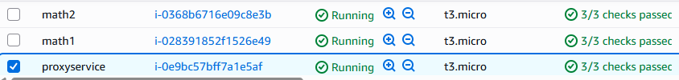
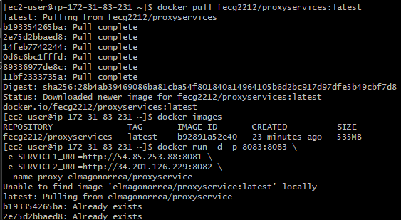

# TDSE-Parcial_2T
Solución del parcial del segundo tercio.

## Inicio
Se empezó creando 2 proyectos.
1. mathservice: este proyecto es el que va a tener toda la lógica y realizará las operaciones matemáticas solicitadas.

2. proxyservice: este proyecto es el encargado de redirigir a las 2 instancias y de realizar el agendamiento de activo pasivo. Si math1 se llega a caer entonces debe redirigir la solicitud a math2

3. Luego se creó un dockerile donde se iba a envolver el servidor

4. Luego lo que se hizo fue crear las imagenes en Docker y crear las 3 maquinas EC2

5. Luego se instalo docker con los comandos de sudo yum install docker -y en las 3 maquinas y al final se hizo push con las imagenes creadas para que las maquinas pudieran hacer pull.

6. y por último con las ips de las 3 maquinas puse el comando para crear el contenedor y correrlo:

docker run -d -p 8083:8083 -e SERVICE1_URL=http://54.85.253.88:8081 -e SERVICE2_URL=http://34.201.126.229:8082 --name proxy elmagonorrea/proxyservice

ya luego en la web se hizo la petición para probar el servidor

